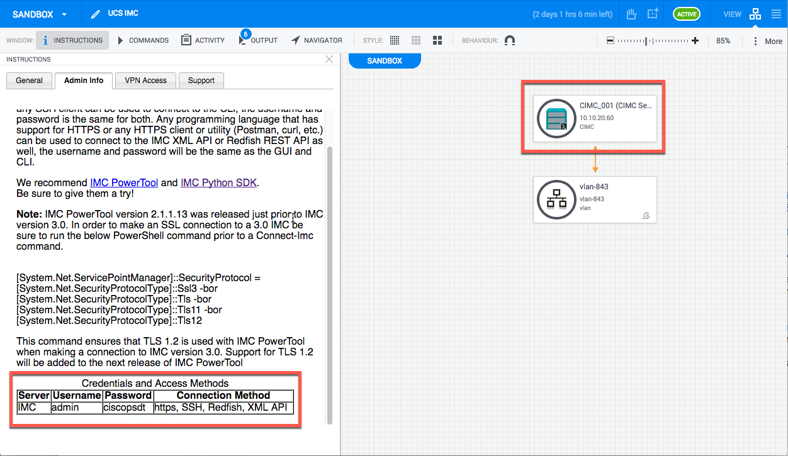
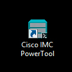
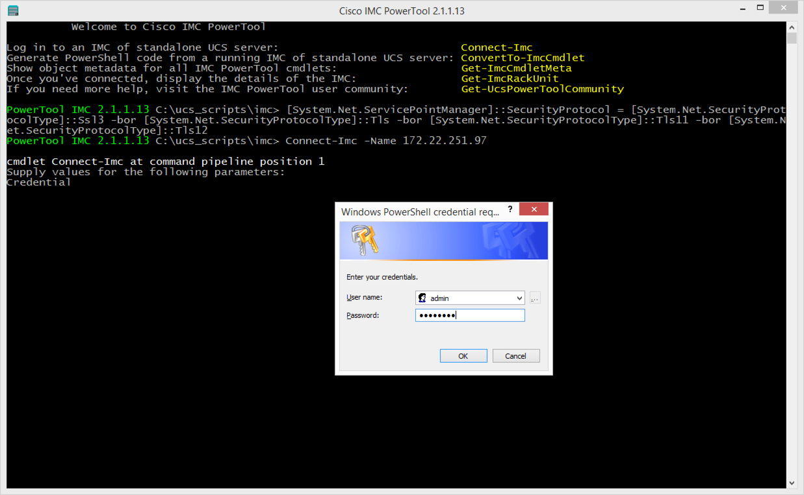
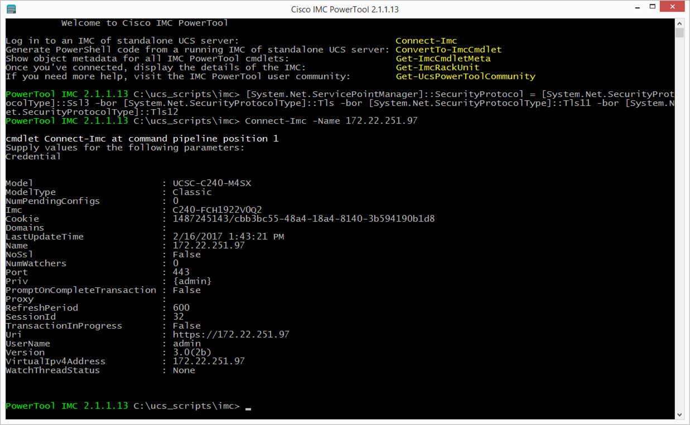
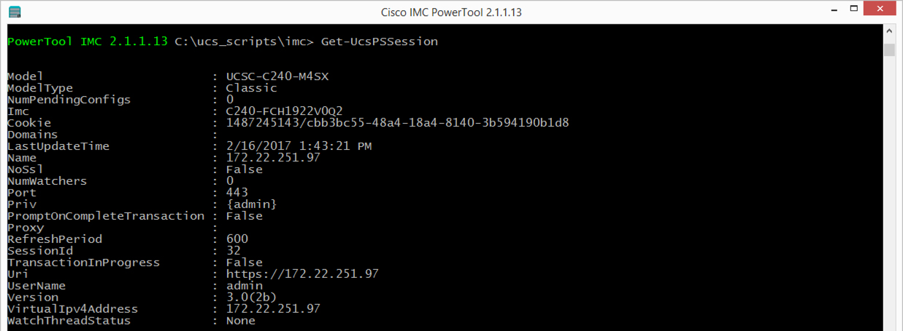
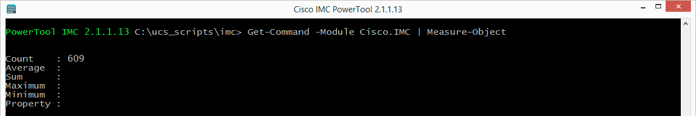
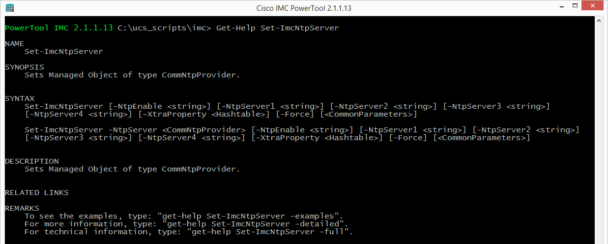
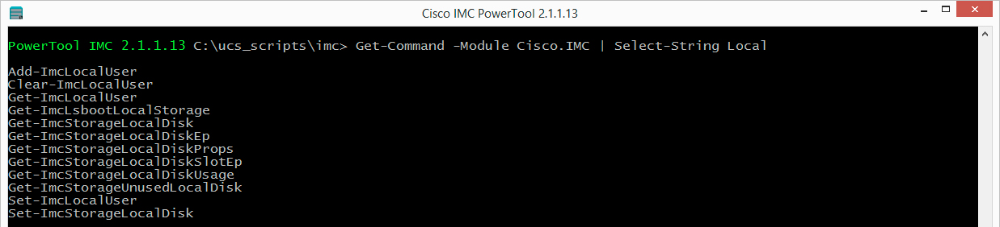
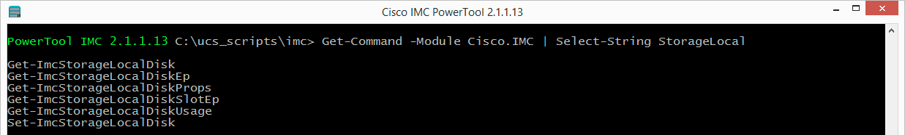

# Introduction to IMC PowerTool

## Overview
The Cisco Integrated Management Controller (IMC) is a baseboard management controller that provides embedded server management for Cisco UCS Stand-Alone Rack Servers. The IMC enables system management in the data center and across distributed locations. It supports multiple management interfaces, including a web user interface (Web UI), a command-line interface (CLI) and an XML API that is consistent with the one used by Cisco UCS Manager. The IMC also supports industry-standard management protocols, including Redfish v1.01, Simple Network Management Protocol Version 3 (SNMPv3) and Intelligent Platform Management Interface Version 2.0 (IPMIv2.0).

The UCS IMC has supported an XML API since its introduction; the UCS IMC components, both physical and logical, are represented as XML objects in a hierarchical Object Model and can be manipulated via the XML API.

All UCS IMC objects are described in an XML schema, this schema defines the objects their attributes and associated values. Because a UCS IMC component must be part of the Object Model to be part of the UCS IMC all components of IMC are always available via the XML API.

IMC PowerTool is a library of PowerShell cmdlets (pronounced command-lets) that enable the management of UCS IMC managed servers from Microsoft Operating Systems via the UCS XML API. The XML schema described above is also used to generate more than 98% of the IMC PowerTool Library.

## Objective
This introduction to IMC PowerTool Learning Lab will guide you through the use of IMC PowerTool to connect to a UCS stand-alone server's IMC, perform queries against IMC objects, change IMC settings, and disconnect from the IMC. UCS IMC Objects are representations of BIOS settings, policies, disk configurations, other logical constructs and physical entities.


## Prerequisites
Prior to starting this learning lab it would be helpful to understand UCS IMC, and the functionality that it provides to manage Cisco UCS Stand-Alone Rack Servers.

An understanding of PowerShell would also be helpful.


## IMC PowerTool
IMC PowerTool is a library of Microsoft PowerShell cmdlets that enable the retrieval and manipulation of IMC managed objects. IMC API interaction can be categorized into several distinct sections:
* Sessions
* Methods
* Queries
* Configurations

IMC PowerTool provides services and cmdlets for all the categorizations of IMC API interactions. It also provides cmdlets that allow for the inspection of object metadata, object hierarchical containment, and object cmdlet action capabilities with pipeline object definitions.

IMC PowerTool cmdlets follow the same structure as Microsoft PowerShell cmdlets (verb-noun) utilizing the defined [Microsoft PowerShell Verbs.](https://msdn.microsoft.com/en-us/library/ms714428%28v=vs.85%29.aspx) IMC PowerTool cmdlet nouns are the UCS IMC objects. For example, to retrieve the rack unit object from UCS IMC, utilize the Get-ImcRackUnit cmdlet.  The Get-ImcRackUnit cmdlet will retrieve the IMC computeRackUnit object from the connected IMC.

## UCS PowerTool download and documentation
IMC PowerTool for UCS IMC is a component in the UCS PowerTool Suite. In addition to UCS IMC, there is also a module for UCS Manager and UCS Central. UCS Central PowerTool library provides cmdlets to manage UCS Central. UCS Central is a manager of UCS Managers. UCS Manager PowerTool is a collection of cmdlets to manage the UCS Manager environments comprised of Fabric-Attached UCS B, C, and S Series servers.

To use IMC PowerTool in your environment be sure to [download](https://software.cisco.com/portal/pub/download/portal/select.html?&mdfid=286305108&flowid=79283&softwareid=284574017) and get the [documentation](http://www.cisco.com/c/en/us/td/docs/unified_computing/ucs/sw/msft_tools/C-Series/powertools/ucs_powertool_book/2x/b_Cisco_IMC_PowerTool_UG_2x.html).

### Event infrastructure utilization
UCS IMC Learning Labs must be completed against actual hardware. The DevNet Sandbox has added physical UCS Server hardware to the Sandbox; you can utilize a [DevNet IMC Sandbox](https://devnetsandbox.cisco.com/RM/Diagram/Index/af205c78-86ac-4be0-a563-a030052f9a0f?diagramType=Topology) or your own hardware to complete this learning lab.

### Exercise 1
Launch IMC PowerTool, connect to an IMC, and disconnect from the IMC.

If you are going through this lab at an event like Cisco Live and using Cisco supplied desktop, PowerShell and UCS PowerTool have been pre-installed, [Official Documentation for Cisco IMC PowerTool](https://www.cisco.com/c/en/us/td/docs/unified_computing/ucs/sw/msft_tools/C-Series/powertools/ucs_powertool_book/2x/b_Cisco_IMC_PowerTool_UG_2x.html).    

**Reminder:** To complete the exercises in this lab you must either have a connection to your UCS hardware or an active VPN connection to a [DevNet IMC Sandbox](https://devnetsandbox.cisco.com/RM/Diagram/Index/af205c78-86ac-4be0-a563-a030052f9a0f?diagramType=Topology). A DevNet Sandbox can take up to 30 minutes to activate.

The IP addresses, username, and password shown in the exercises are illustrative of their use. The IP address and credentials of your hardware or the DevNet Sandbox may be different. The IP address and credentials for the DevNet Sandbox IMC is shown in your sandbox topology.

  <br/><br/>

1. Launch IMC PowerTool by double clicking the IMC PowerTool icon on the Desktop.

    IMC PowerTool Icon:

    <br/><br/>

2. An IMC PowerTool for UCS Manager Console will open. Due to a change in IMC supported SSL/TLS capabilities that is not yet reflected in the latest release of IMC PowerTool, enter this command to enable a secure connection to the IMC:

    ```
    [System.Net.ServicePointManager]::SecurityProtocol = [System.Net.SecurityProtocolType]::Ssl3 -bor [System.Net.SecurityProtocolType]::Tls -bor [System.Net.SecurityProtocolType]::Tls11 -bor [System.Net.SecurityProtocolType]::Tls12
    ```
  <br/><br/>

3. Connect to to the IMC and use the credentials for your IMC in the login dialog:

    `Connect-Imc -Name <imc-ip-address>`.

    User: `<username>`.

    Password: `<password>`.

    Connect-Imc credentials dialog:

    <br/><br/>

4. View the results of a successful login.

    Connect-Imc output:

    <br/><br/>

  There are several items shown in the console, these items are all attributes of the "login object" or "UCS PowerTool PS Session".


5. Get the UCS PS Session — at the prompt, type: `Get-UcsPSSession`.

    The description and command does not have a typo. Some of the PowerTool cmdlets are shared across all the PowerTool modules. Most, 99%, of the Imc cmdlets will have the Imc prefix on the "noun"; the shared cmdlets will have a Ucs prefix.

    The output is the same as from the `Connect-Imc` cmdlet.  There are some interesting components to a UCS PS Session:
    - the `Cookie` is the authentication token for the current session.
    - the `NoSsl` indicates is the session is secure or not; this could also be determined by the `Uri` value.

    Get-UcsPSSession output:

    <br/><br/>

6. Disconnect from the Imc — at the prompt, type `Disconnect-Imc`.

    Disconnect-Imc output:

    <br/><br/>

    The logout object is returned.

This is the end of Exercise 1.


### Exercise 2
Get Help on and find any IMC PowerTool cmdlet. IMC PowerTool has over 600 cmdlets and functions; that's a lot of cmdlets to know. In fact, the entire UCS PowerTool Suite has over 6,000 cmdlets. Fortunately, the PowerShell `Get-Help` cmdlet works with IMC PowerTool.

1. Count the number of IMC PowerTool Cmdlets — at the prompt, type `Get-Command -Module Cisco.IMC | Measure-Object`.

    Get-Command output:

    <br/><br/>

2. Get help with the cmdlet Set-ImcNtpServer — at the prompt, type `Get-Help Set-ImcNtpServer`.

    Get-Help Set-ImcNtpServer output:

    <br/><br/>

3. Find the cmdlets to manage Local Storage — at the prompt, type `Get-Command -Module Cisco.IMC | Select-String Local`.

    Get-Command | Local output:

    <br/><br/>

    Hmmm, so a few more cmdlets than just Storage. Let's narrow it down by searching for **StorageLocal**.  To get the Get-Command | StorageLocal output, at the prompt, type `Get-Command -Module Cisco.IMC | Select-String StorageLocal`.

    <br/><br/>

    That's more like it; with this technique you should be able to find most IMC cmdlets.

This is the end of Exercise 2.
