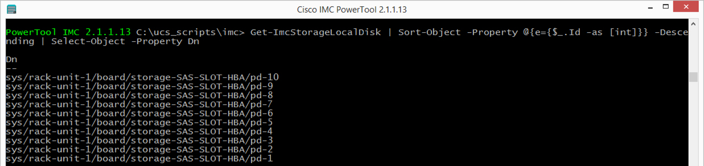

# Introduction to IMC PowerTool

### Exercise 3
Launch IMC PowerTool, connect to an IMC, query for various IMC objects and manipulate the output. Then disconnect from the IMC.

1. Re-Connect to to the IMC and use the credentials for your IMC in the login dialog

    `Connect-Imc -Name <imc-ip-address>`

    User: `<username>`

    Password: `<password>`
      

2. Query for the IMC for the Rack Unit. At the prompt type

  `Get-ImcRackUnit`

  Get-ImcRackUnit:

    

  There is a lot of output from this Cmdlet, but perhaps we are only interested in seeing the Dn of the Rack Unit.
    

3. To retrieve just the Dn of the Rack Unit, at the prompt type

  `Get-ImcRackUnit | Select-Object Dn`

  Get-ImcRackUnit | Select-Object Dn:

    

  The Dn has been retrieved, but what exactly is a Dn? A Dn is the **Distinguished Name** of the IMC Object.  Every object in the IMC has a Dn, it is an unambiguous reference to the object in the entire IMC Object Model.

  IMC objects along with having a Dn that uniquely identifies them, also belong to a particular Object Class. The Class type for a UCS stand-alone server is `computeRackUnit`

  There can be multiple objects of a specific class type, however there is one and only one object that has a specific Dn. For Example the server's local disks are class type `storageLocalDisk`
    

4. To retrieve the Dns of the server's local disk use the following Cmdlet. At the prompt type

  `Get-ImcStorageLocalDisk | Select-Object Dn`

  Get-ImcStorageLocalDisk output:

    

  Take a moment to look at the output, it may not be sorted in disk order or maybe you want descending order. When multiple objects of the same class type are retuned from the IMC there is no guaranteed order. We'll get to how to change the order of output in a couple of steps. First let's focus on a specific object.
    

5. To retrieve a specific disk there are a couple of ways to do it. The specific Dn to retrieve could be specified or the PowerShell Where-Object construct could be utilized to select a specific object.

  Try to retrieve a local disk by Dn first, select a Dn from the previous Cmdlet output. At the prompt type

  `Get-ImcStorageLocalDisk -Dn sys/rack-unit-1/board/storage-SAS-SLOT-HBA/pd-1`

  Get-ImcStorageLocalDisk -Dn output:

    
    

6. To try the PowerShell way to select a specific object, at the command prompt type

  `Get-ImcStorageLocalDisk | Where-Object { $_.dn -eq "sys/rack-unit-1/board/storage-SAS-SLOT-HBA/pd-1"}`

  Get-ImcStorageLocalDisk | Where-Object output:

    

  The output is the same, so how are these two ways to retrieve an object by Dn different?

  In the first way

  `Get-ImcStorageLocalDisk -Dn sys/rack-unit-1/board/storage-SAS-SLOT-HBA/pd-1`

  The Cmdlet `Get-ImcStorageLocalDisk` is going to retrieve all the `storageLocalDisk` objects and only output the object where the Dn matches the specified Dn.

  In the second way

  `Get-ImcStorageLocalDisk | Where-Object { $_.dn -eq "sys/rack-unit-1/board/storage-SAS-SLOT-HBA/pd-1"}`

  The Cmdlet Get-ImcStorageLocalDisk returns all the storageLocalDisk objects and pipes each one of those objects to the PowerShell Where-Object Cmdlet. The Where-Object Cmdlet does the filtering of the returned objects and only outputs the object where the Dn matches the specified Dn.

  Every IMC object has attributes, so far with the computeRackUnit and storageLocalDisk objects we have only retrieved the Dn attribute. We have also run the IMC PowerTool Cmdlets with only one parameter. The Cmdlets support many parameters related to the IMC object as well as the [Microsoft PowerShell Common Parameters](https://technet.microsoft.com/en-us/library/hh847884.aspx)

  We saw to retrieve a IMC computeRackUnit resource by its Dn specify the Dn as a parameter to the Cmdlet.
    

7. Earlier when retrieving the Dn for the storageLocalDisk object we saw the Dns returned in a non numerical order or in ascending order and it was also indicated that the objects can be returned in any order.  To sort the returned objects we can use the Sort-Object Cmdlet and utilize the Id attribute of the storageLocalDisk object to sort the returned objects in numerical order. At the prompt type

  `Get-ImcStorageLocalDisk | Sort-Object -Property -Id | Select-Object -Property Dn`

  Get-ImcStorageLocalDisk | Sort-Object output:

    

  Hmmm, that looks the same as the Dn retrieval Cmdlet from earlier in this lab and could be different on your system. The reason is that the Id value in the attribute is a string, in order to get a numerical sorting Id needs to cast to an integer when sorting the objects.

  At the prompt type

  `Get-ImcStorageLocalDisk | Sort-Object -Property @{e={$_.Id -as [int]}} | Select-Object -Property Dn`

  Get-ImcStorageLocalDisk | Sort-Object output:

    

  Much better, in IMC PowerTool all of the returned object's attribute values are represented as strings. If the string is a number and you want to use the number for a calculation or sorting or any other operation that is dependent upon the value being a number, the value must first be converted to a number.
    
  
8. Try Descending order, at the prompt type

  `Get-ImcStorageLocalDisk | Sort-Object -Property @{e={$_.Id -as [int]}} -Descending | Select-Object -Property Dn`

  Get-ImcStorageLocalDisk | Sort-Object Descending output:

    

This is the end of exercise 3.
