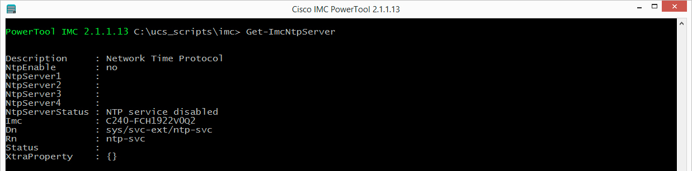
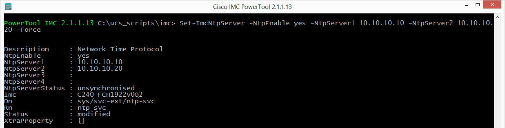
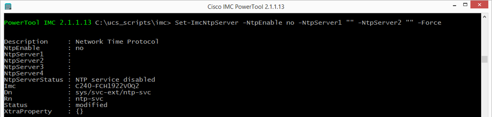
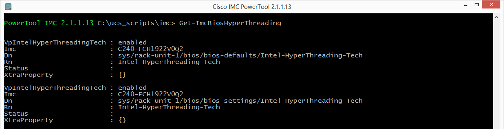
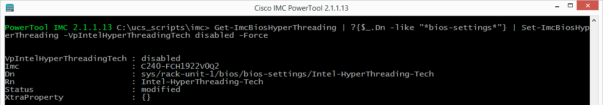
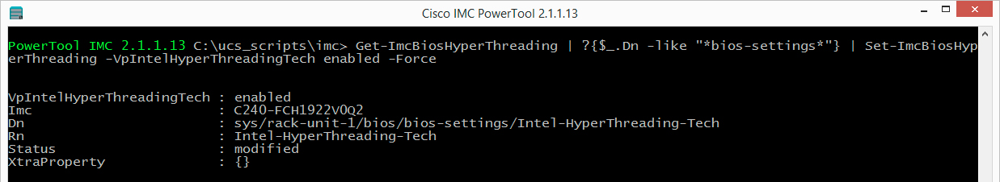
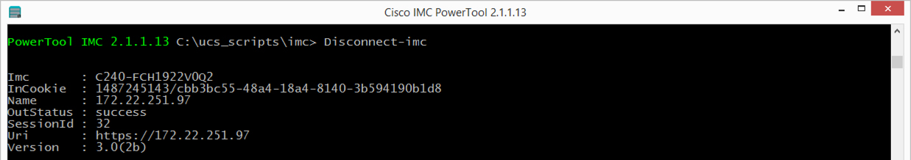

# Introduction to IMC PowerTool

### Exercise 4
Launch IMC PowerTool, connect to an IMC, query for various objects, modify the objects and set the new object values in the IMC.

1. Re-Connect (if not already connected) to to the IMC and use the credentials for your IMC in the login dialog

    `Connect-Imc -Name <imc-ip-address>`

    User: `<username>`

    Password: `<password>`
      

2. Query the IMC NTP Settings, at the prompt type

  `Get-ImcNtpServer`

  Get-ImcNtpServer output:

    

  You can see if the NTP service is enabled or disabled and if any NTP Servers are assigned.
    

3. Enable the NTP Service and set two NTP Servers, at the prompt type

  `Set-ImcNtpServer -NtpEnable yes -NtpServer1 10.10.10.10 -NtpServer2 10.10.10.20 -Force`

  Set-ImcNtpServer output:

    

4. Disable and remove assinged NTP Servers, at the prompt type

  `Set-ImcNtpServer -NtpEnable no -NtpServer1 "" -NtpServer2 "" -Force`

    

This is the end of exercise 4.

### Exercise 5
IMC managed servers expose all of the BIOS settings via the XML API. This exposure makes them manageable via IMC PowerTool. Most BIOS settings are either **enabled** or **disabled** or **platform-default**. There are a few BIOS settings that have a number of options, for example setting the Serial Configuration or setting the Power Technology. Please refer to the [IMC user guides](http://www.cisco.com/c/en/us/td/docs/unified_computing/ucs/c/sw/cli/config/guide/3_0/b_Cisco_UCS_C-Series_CLI_Configuration_Guide_301/b_Cisco_UCS_C-Series_CLI_Configuration_Guide_201_appendix_010000.html) for BIOS tuning parameters.

1. Query the HyperThreading BIOS setting, at the prompt type

  `Get-ImcBiosHyperThreading`

  Get-ImcBiosHyperThreading output:

    

  Notice that there are two objects returned. One object is the actual BIOS setting and one is the BIOS default. You can determine which is which by looking at the Dn. The Dn will indicate that the object is either the platform-default (*bios-defaults*) or the current setting (*bios-settings*).

  You can also determine what the setting is, in this case the `VpIntelHyperThreadingTech` attribute of the bios-settings object is set to **enabled**
    

2. Set the HyperThreading BIOS setting to **disabled** without changing the **platform-default**. To do this you have to ensure that the object you are changing is the bios-settings object, at the prompt type

  `Get-ImcBiosHyperThreading | ?{$_.Dn -like "*bios-settings*"} | Set-ImcBiosHyperThreading -VpIntelHyperThreadingTech disabled -Force`

  Get-ImcBiosHyperThreading | Set-ImcBiosHyperThreading disabled output:

    

3. Go ahead and set the BIOS setting for HyperThreading back to **enabled** at the prompt type

  `Get-ImcBiosHyperThreading | ?{$_.Dn -like "*bios-settings*"} | Set-ImcBiosHyperThreading -VpIntelHyperThreadingTech enabled -Force`  

  Get-ImcBiosHyperThreading | Set-ImcBiosHyperThreading enabled output:

    

  4. Disconnect from the Imc, at the prompt type

  `Disconnect-Imc`

  Disconnect-Imc output:

    

  The logout object is returned.

  You have seen and gone though exercises to connect, query, configure and disconnect. Hopefully this will get you started with Cisco IMC automation with IMC PowerTool.

This is the end of exercise 5.

This concludes the lab - Introduction to IMC PowerTool
