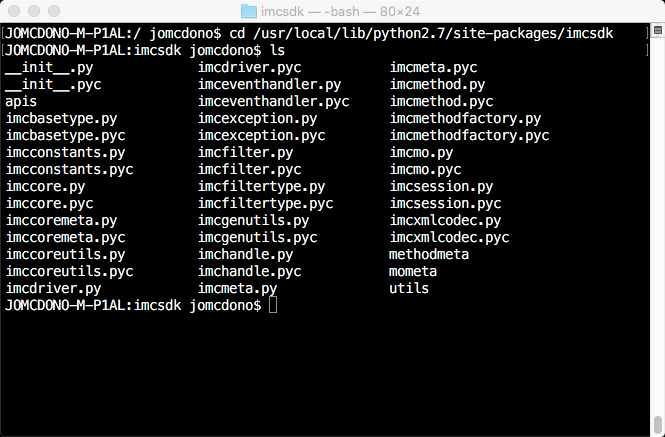

# Introduction to Cisco IMC Python SDK

## Overview
The Cisco Integrated Management Controller (IMC) is a baseboard management controller that provides embedded server management for Cisco UCS Stand-Alone Rack Servers. The IMC enables system management in the data center and across distributed locations. It supports multiple management interfaces, including a web user interface (Web UI), a command-line interface (CLI) and an XML API that is consistent with the one used by Cisco UCS Manager. The IMC also supports industry-standard management protocols, including Redfish v1.01, Simple Network Management Protocol Version 3 (SNMPv3) and Intelligent Platform Management Interface Version 2.0 (IPMIv2.0).

The UCS IMC has supported an XML API since its introduction, the UCS IMC components both physical and logical are represented as XML objects in a hierarchical Object Model and can be manipulated via the XML API.

All UCS IMC objects are described in an XML schema, this schema defines the objects their attributes and associated values. Because a UCS IMC component must be part of the Object Model to be part of the UCS IMC all components of IMC are always available via the XML API.

IMC Python SDK is a collection of Python classes, methods and utilities that enable the management of UCS IMC managed servers from any operating system that supports Python 2.7 and higher and 3.5 and higher, via the UCS XML API. The XML schema described above is also used to generate more than 98% of the IMC Python SDK.

## Objective
This Introduction to IMC Python SDK Learning Lab will guide you through the use of IMC Python SDK to connect to a UCS stand-alone server's IMC, perform queries against IMC objects, change IMC settings and disconnect from the IMC. UCS IMC Objects are representations of BIOS settings, policies, disk configurations, other logical constructs and physical entities.

Completion time: 30 minutes

## Prerequisites
Prior to starting this learning lab it would be helpful to understand UCS IMC and the functionality that it provides to manage Cisco UCS Stand-Alone Rack Servers.

An understanding of Python and the IDLE editor would also be helpful as is [installing](https://ciscoucs.github.io/imcsdk_docs/imcsdk_ug.html#installation) the IMC Python SDK

## IMC Python SDK
IMC Python SDK is a collection of Python Classes and Modules that enable the retrieval and manipulation of IMC managed objects. IMC API interaction can be categorized into several distinct sections.
* Sessions
* Methods
* Queries
* Configurations

IMC Python SDK provides classes and methods for all the categorizations of IMC API interactions, along with methods that allow for the inspection of object metadata and object hierarchical containment.

## IMC Python SDK Download and Documentation
UCS Python SDK is a Cisco managed community involvement project, the code and documentation and repositories are on [github.com](https://github.com/CiscoUcs/imcsdk).

### Event Infrastructure Utilization
UCS IMC Learning Labs must be completed against actual hardware. The DevNet Sandbox has added physical UCS Server hardware to the Sandbox, you can utilize a [DevNet IMC Sandbox](https://devnetsandbox.cisco.com/RM/Diagram/Index/af205c78-86ac-4be0-a563-a030052f9a0f?diagramType=Topology) or your own hardware to complete this learning lab.

### Exercise 1
Explore – list modules / packages in Python SDK.

If you are going through this lab at an event like Cisco Live and using Cisco supplied desktop, Python 2.7 has been pre-installed, along with the Cisco IMC Python SDK. - [Official Documentation for the IMC Python SDK](https://ciscoucs.github.io/imcsdk_docs)    

  1. Open Windows File Manager or a Command prompt session (or equivalent on a MAC) to locate and view the Python modules and associated python scripts available with the Cisco IMC Python SDK (note: all third party Python modules are typically located in the subdirectory: **site-packages** this layout is the same for Python 2.X and 3.X, this lab utilizes Python 2.7)

    Windows Command Prompt:

    ```
    cd c:\Python27\Lib\site-packages\imcsdk
    dir /w
    ```

    </br></br>

    MAC Command Prompt (this MAC is using the [brew](https://brew.sh/) package manager, it may be different on your MAC):

    ```
    cd /usr/local/lib/python2.7/site-packages/imcsdk
    ls
    ```

    MAC directory listing:

    </br></br>

    Windows File Manager:

    </br></br>

  2. Under the imcsdk directory (from this point forward in the lab the Windows platform is utilized), you will find the "mometa" directory (Managed Object metadata). If you look inside any of the subdirectories (ex: BIOS), you will see modules/scripts that map to all the classes available in the IMC XML API Model:

  Windows File Manager imcsdk/mometa/bios:

  </br></br>

This is the end of exercise 1

### Exercise 2
View IMC Python SDK help and make a connection to the IMC

  1. *Double Click* the IDLE editor shortcut to open an IDLE session

    Python IDLE Editor:

    </br></br>

  2. IMC Python SDK has help built into the source. To view help, first import the desired module and run help on the class name. At the prompt type

    ```Python
    from imcsdk.imchandle import ImcHandle
    help(ImcHandle)
    ```

    IMC Python SDK help

    </br></br>

    Now that the "imchandle" module has been imported, the ImcHandle class can be instantiated and a connection to an IMC can be created.

    The ImcHandle class is defined in the [imchandle python module](https://ciscoucs.github.io/imcsdk_docs/_modules/imcsdk/imchandle.html#ImcHandle). It provides all the communication between your python program and the IMC. Through an instance of ImcHandle your python program can query, create, update and delete IMC objects.

    We can see from the "help" the different ways that can be used to instantiate the ImcHandle class.

    ```
    Args:
         ip (str): The IP or Hostname of the IMC Server

         username (str): The username as configured on the Imc Server

         password (str): The password as configured on the Imc Server

         port (int or None): The port number to be used during connection

         secure (bool or None): True for secure connection, otherwise False

         proxy (str): The proxy object to be used to connect

     Example:
         handle = ImcHandle("192.168.1.1","admin","password")

         handle = ImcHandle("192.168.1.1","admin","password", secure=True)

         handle = ImcHandle("192.168.1.1","admin","password", secure=False)

         handle = ImcHandle("192.168.1.1","admin","password", port=80)

         handle = ImcHandle("192.168.1.1","admin","password", port=443)

         handle = ImcHandle("192.168.1.1","admin","password", port=100,secure=True)

         handle = ImcHandle("192.168.1.1","admin","password", port=100,secure=False)
    ```

    **Reminder:** To complete the rest of the exercises in this lab you must either have a connection to your UCS hardware or an active VPN connection to a [DevNet IMC Sandbox](https://devnetsandbox.cisco.com/RM/Diagram/Index/af205c78-86ac-4be0-a563-a030052f9a0f?diagramType=Topology). A DevNet Sandbox can take up to 30 minutes to activate.

    The IP addresses, username and password shown in the exercises are illustrative of their use. The IP address and credentials of your hardware or the DevNet Sandbox may be different. The IP address and credentials for the DevNet Sandbox IMC is shown in your sandbox topology.

    </br></br>

  3. Create an ImcHandle object and login to the IMC, at the prompt type

    ```Python
    from imcsdk.imchandle import ImcHandle
    handle = ImcHandle("10.10.20.60","admin","ciscopsdt")
    handle.login()
    ```

    If everything is correct you should see **True** displayed in the IDLE editor.

    handle.login():

    </br></br>

  4. Inspect the **handle** object, at the prompt type

    ```Python
    vars(handle)
    ```

    vars(handle):

    </br></br>

    There is quite a bit of information contained in the handle object instantiation of the ImcHandle class. In fact in the handle object there are attributes with values and also methods.

    One of the methods `handle.login()` was used to make the connection to the IMC.

  5. View some handle object attributes, at the prompt type

    ```Python
    handle.cookie
    handle.ip
    handle.imc
    ```

    handle attributes:

    </br></br>

  6. Disconnect from the IMC, at the prompt type

    ```Python
    handle.logout()
    ```

    handle.logout():

    </br></br>

    If everything is correct you should see **True** displayed in the IDLE editor.

This is the end of exercise 2
