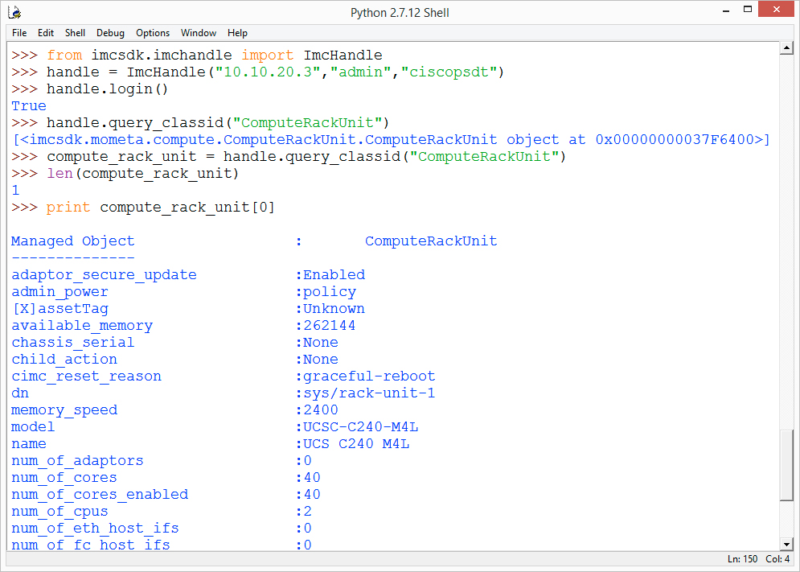
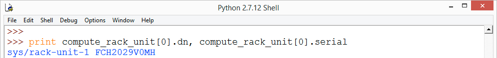
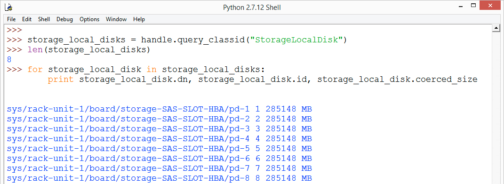
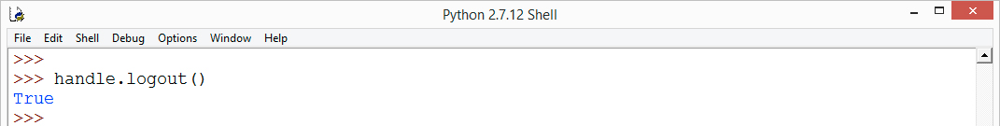
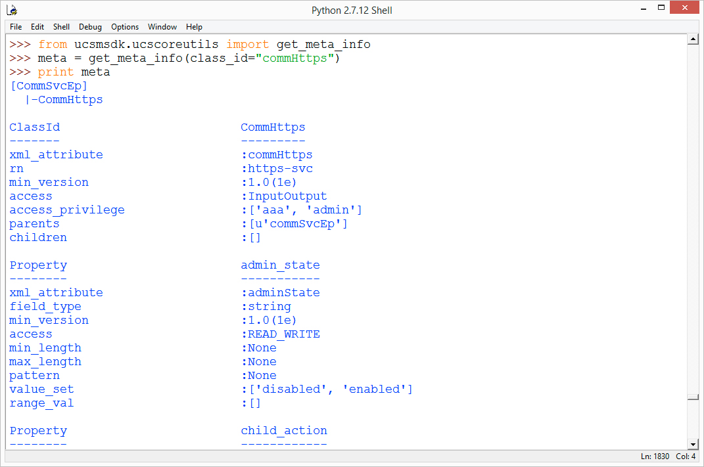
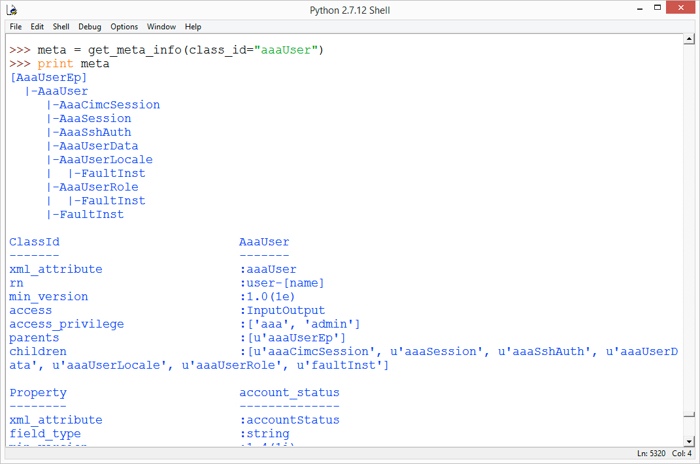

# Introduction to Cisco IMC Python SDK

### Exercise 3
Connect to an IMC, query for various IMC object Classes and manipulate the output. Then disconnect from the IMC.

  1. Create an ImcHandle object and login to the IMC, at the prompt type

    ```Python
    from imcsdk.imchandle import ImcHandle
    handle = ImcHandle("10.10.20.60","admin","ciscopsdt")
    handle.login()
    ```
    </br></br>

  2. Query the class ID ComputeRackUnit, at the prompt type

    ```Python
    handle.query_classid("ComputeRackUnit")
    ```

    You should get back something similar to this

    ```
    [<imcsdk.mometa.compute.ComputeRackUnit.ComputeRackUnit object at 0x00000000037F6400>]
    ```

    Which is good but it just means that the objects of that class type were retrieved, you need to store the class Id query results in a variable if you want to do something with them.
    </br></br>

  3. Store the query class Id results in a variable, at the prompt type

    ```Python
    compute_rack_unit = handle.query_classid("ComputeRackUnit")
    ```
    </br></br>

  4. Determine how many ComputeRackUnit class objects were retrieved, at the prompt type

    ```Python
    len(compute_rack_unit)
    ```

    There should only be one ComputeRackUnit object.
    </br></br>

  5. Print the ComputeRackUnit object, at the prompt type

    ```Python
    print compute_rack_unit[0]
    ```

    The entire ComputeRackUnit object is displayed.

    Print ComputeRackUnit:

    </br></br>

  6. Print just the ComputeRackUnit dn and the serial number, at the prompt type

    ```Python
    print compute_rack_unit[0].dn, compute_rack_unit[0].serial
    ```

    Print ComputeRackUnit dn and serial number:

    </br></br>

    The Dn has been retrieved, but what exactly is a Dn? A Dn is the **Distinguished Name** of the IMC Object.  Every object in the IMC has a Dn, it is an unambiguous reference to the object in the entire IMC Object Model.

    IMC objects along with having a Dn that uniquely identify them, also belong to a particular Object Class. The Class type for a UCS stand-alone server is `computeRackUnit`

    There can be multiple objects of a specific class type, however there is one and only one object that has a specific Dn. For Example the server's local disks are class type `storageLocalDisk`
    </br></br>

  7. Query the Server's Local Storage, determine how many storageLocalDisk objects were returned and print out the dn, id, and coerced_size for the returned disks, at the prompt type

    ```Python
    storage_local_disks = handle.query_classid("StorageLocalDisk")
    len(storage_local_disks)

    for storage_local_disk in storage_local_disks:
  	   print storage_local_disk.dn, storage_local_disk.id, storage_local_disk.coerced_size
    ```

    Print StorageLocalDisk dn, id and coerced_size:

    </br></br>

    Because query_classid returns a list, the list can be looped through without having to know the length of the list. Even if there is only one object returned from a `query_classid` like the ComputeRackUnit object, the object(s) will always be in a list.
    </br></br>

  8. Disconnect from the IMC, at the prompt type

    ```Python
    handle.logout()
    ```
    </br></br>

    Disconnect from IMC:

    </br></br>

This is the end of exercise 3

### Exercise 4
IMC Python SDK has built in help as we saw earlier in the lab, it also has built in MetaData. The built in MetaData allows you to find where objects fit in the IMC Object Model and what attributes and potential values an object can have.

  1. View Class/Object MetaData, at the prompt type

    ```Python
    from ucsmsdk.ucscoreutils import get_meta_info
    meta = get_meta_info(class_id="CommHttps")
    print meta
    ```
    </br></br>

    CommHttps MetaData:

    </br></br>

    There are a number of things shown here, you'll have to scroll up to get to the top of the output. First is the containment of the object, in this case `CommHttps` objects are contained under `CommSvcEp`. Also every attribute and all the MetaData for each attribute is displayed. For example the `admin_state` attribute's value_set is displayed which enables the programmatic ability to do validation of input that is meant for `admin_state`
    </br></br>

  2. Retrieve and view MetaData for other classes, at the prompt type

    ```Python
    meta = get_meta_info(class_id="FirmwareBootDefinition")
    print meta

    meta = get_meta_info(class_id="AaaUser")
    print meta
    ```

    There are thousands of classes, for these two classes you should notice that not only are they children of a class they have children classes as well.

    More Object MetaData:

    </br></br>

This is the end of exercise 4
