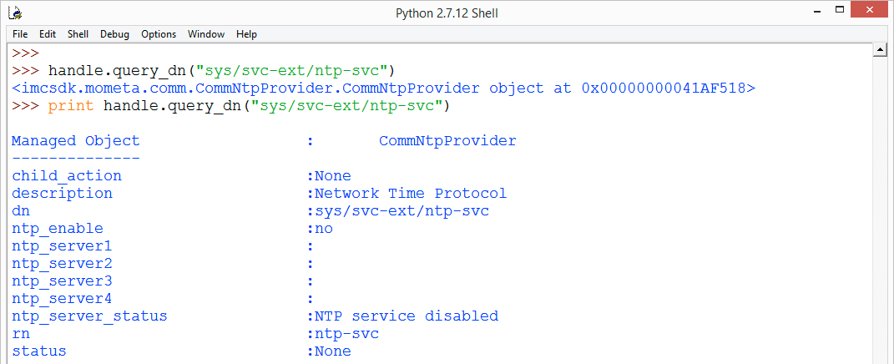
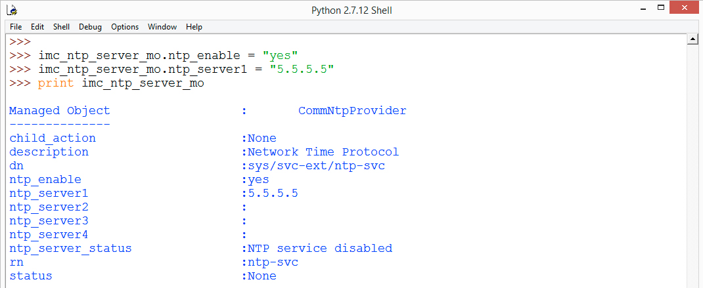
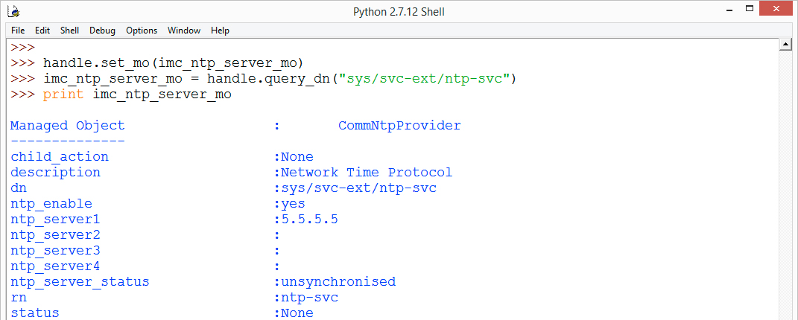
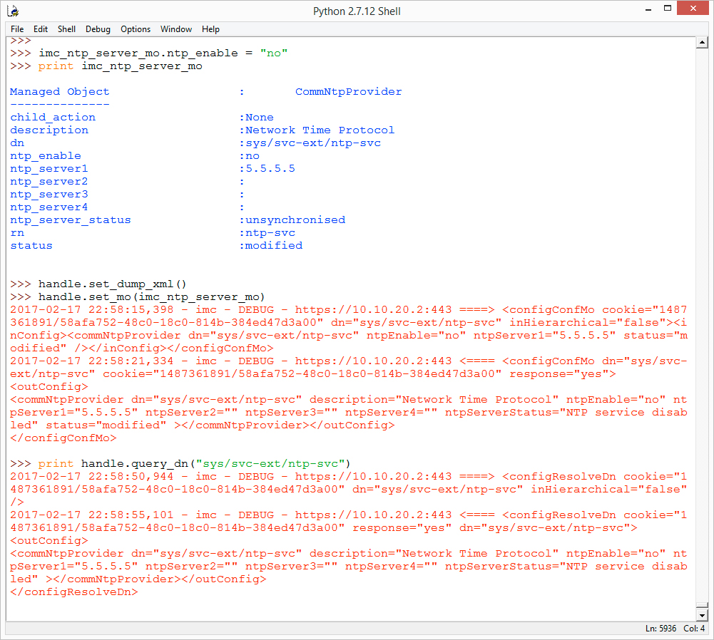

# Introduction to Cisco IMC Python SDK

### Exercise 5
Connect to an IMC, query for the NTP Server IMC object Dn.

  1. Create an ImcHandle object and login to the IMC (if not already connected), at the prompt type

    ```Python
    from imcsdk.imchandle import ImcHandle
    handle = ImcHandle("10.10.20.60","admin","ciscopsdt")
    handle.login()
    ```

  2. Query the Dn for the NTP Server object, at the prompt type

    ```Python
    handle.query_dn("sys/svc-ext/ntp-svc")
    print handle.query_dn("sys/svc-ext/ntp-svc")
    ```
    Remember you cannot print the results if you do not store the results in a variable or use the `print` statement directly.

    Retrieve NTP Server object by Dn:

    </br></br>

    Retrieving an object by it's Dn will only ever return a single object since a Dn represents a unique object within the IMC Object Model.

    Retrieving a Dn is the first step in modifying an object.

This is the end of exercise 5

### Exercise 6
Modify the NTP Server IMC Object.

  1. Query for the NTP Server Dn and place the object in a variable, at the prompt type

    ```Python
    imc_ntp_server_mo = handle.query_dn("sys/svc-ext/ntp-svc")
    print imc_ntp_server_mo
    ```

    The output should look the same as the last exercise.

  2. Change the value for ntp_server1 and set ntp_enable to yes, at the prompt type

    ```Python
    imc_ntp_server_mo.ntp_enable = "yes"
    imc_ntp_server_mo.ntp_server1 = "5.5.5.5"
    print imc_ntp_server_mo
    ```

    Changed NTP Server Object:

    </br></br>

    At this point the object is changed locally, the next step is to commit the change to the IMC

  3. Commit the changes to the IMC, at the prompt type

    ```Python
    handle.set_mo(imc_ntp_server_mo)
    ```

    It's that simple, to check your changes, query the Dn and print it output

  4. Check you changes, at the prompt type

    ```Python
    imc_ntp_server_mo = handle.query_dn("sys/svc-ext/ntp-svc")
    print imc_ntp_server_mo
    ```

    Committed NTP Server Object:

    </br></br>

    Since you have the NTP Server Object handy, let's disable it.

  5. Disable the NTP Server commit the changes and check them, also let's turn on the XML dump feature of the the IMC Python SDK. This way we'll be able to see the XML request and response, at the prompt type

    ```Python
    imc_ntp_server_mo.ntp_enable = "no"
    print imc_ntp_server_mo
    handle.set_dump_xml()
    handle.set_mo(imc_ntp_server_mo)
    print handle.query_dn("sys/svc-ext/ntp-svc")
    ```

    Change and Commit NTP Server Object with XML Dump:

    </br></br>

    The `set_dump_xml()` method tells IMC Python SDK to show the XML request to the IMC and the XML response from the IMC. The `unset_dump_xml()` method turns off the XML dump.

  6. Turn off XML dump and disconnect from IMC, at the prompt type

    ```Python
    handle.unset_dump_xml()
    handle.logout()
    ```

    Turn off XML Dump and Disconnect from IMC:

    </br></br>

This is the end of exercise 6

This concludes the lab - Introduction to IMC Python SDK
