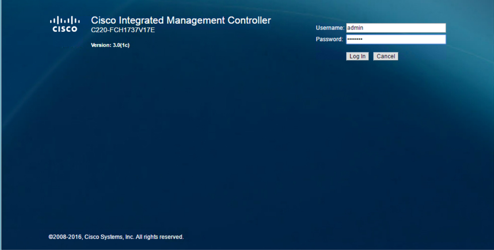

# Introductory UCS IMC Redfish REST API

## Overview
Cisco UCS IMC is the UCS Server Integrated Management Controller. IMC version 3.0 has added support for [DTMF's Redfish](https://www.dmtf.org/standards/redfish). DMTF’s Redfish is an open industry standard specification and schema that specifies a RESTful interface and utilizes JSON and OData to help customers integrate solutions within their existing tool chains.

Cisco UCS IMC has supported an XML API since its introduction, the UCS IMC components both physical and logical are represented as XML objects in a hierarchical Object Model format and can be manipulated via the XML API.

All UCS IMC objects are described in an XML schema, this schema defines the objects their attributes and associated values. Because a UCS IMC component must be part of the Object Model to be part of the UCS system all components of UCS are always available via the XML API.

The UCS IMC Redfish implementation exposes a significant number of the UCS IMC objects that are available via the existing XML API. While not all UCS IMC objects are exposed via the Redfish API, the Redfish API provides a RESTful interface that has not been available previously for UCS IMC.

## Objective
This Introductory UCS IMC Redfish REST API Learning Lab will guide you through the use of UCS IMC Redfish to connect to UCS IMC, retrieve an authorization token, create a session, retrieve various settings and manage a user (create/update/delete).

Completion time: 45 minutes

## Prerequisites
Prior to starting this learning lab it would be helpful to understand UCS IMC and the functionality that it provides for UCS IMC managed servers. It would also be helpful to understand Redfish, REST API constructs, JSON and OData.

This Learning Lab utilizes the curl command line utility and Postman to interact with the UCS IMC Redfish REST API, an understanding of curl and Postman would be helpful but is not required.

## UCS IMC Redfish
UCS IMC is the Integrated Management Controller that allows for the configuration and monitoring of a UCS Server. The UCS IMC Redfish implementation provides the following features and more.

* Sessions
* Queries
* Configuration Management
* Firmware Updates
* Event Subscription

## UCS IMC Redfish Documentation
To learn more about the UCS IMC Redfish REST API implementation review the [Cisco UCS C-Series Servers REST API Programmer's Guide, Release 3.0](http://www.cisco.com/c/en/us/td/docs/unified_computing/ucs/c/sw/api/3_0/b_Cisco_IMC_REST_API_guide_301.html)

Currently UCS IMC Redfish is supported on most UCS M3 and M4 Servers running version 3.0 or higher. For a complete list of where UCS IMC version 3.0 or higher is supported please refer to the UCS IMC [release notes](https://www.cisco.com/c/en/us/td/docs/unified_computing/ucs/release/notes/b_UCS_C_Series_Release_Notes_3_0_1.html).

### Event Infrastructure Utilization
UCS IMC Learning Labs must be completed against actual hardware. The DevNet Sandbox has added physical UCS Server hardware to the Sandbox, you can utilize a [DevNet IMC Sandbox](https://devnetsandbox.cisco.com/RM/Diagram/Index/af205c78-86ac-4be0-a563-a030052f9a0f?diagramType=Topology) or your own hardware to complete this learning lab.

### Redfish™ Architecture
The Redfish™ API comprises a folder structure that starts with the Redfish root at “/redfish/”. In case of a UCS IMC managed server, the root is accessed through the URI https:/{{imc_ip}/redfish/v1/ - the “v1” at the end of the URI denotes the version of the API.

The URI is the primary unique identifier of resources. Redfish™ URIs consist of three parts as described in [RFC3986](http://www.ietf.org/rfc/rfc3986.txt):

  - Part one defines the scheme and authority of the URI
  - Part two specifies the root service and version
  - Part three defines a unique resource identifier

For example, in the following URI: https://mgmt.vendor.com/redfish/v1/Systems/SvrID:

  - https://mgmt.vendor.com is the scheme and authority
  - /redfish/v1 is the root and version
  - /Systems/SvrID is the resource identifier

### Redfish™ Tree Structure
The Redfish tree structure comprises a top-level root from where the RESTful interface branches out to cover a number of “Collections” that subsequently include multiple levels within, creating a tree-like structure. You can navigate down to this structure to find information and settings.

For example, accessing the Redfish™ structure for a storage controller on a C-Series UCS server would be navigated by using the following path: https://10.10.10.10/redfish/v1/Systems/FCH2005V1EN/SimpleStorage/SLOT-HBA

  - Note: Some portions of an API path could vary depending on the hardware configuration. For example, “SLOT-HBA” may be different when another type of RAID controller is installed in the managed server.

### Redfish™ Operations
Redfish™ uses HTTPS methods to perform the operations of a RESTful API. You can specify the type of request being made. It adheres to a standard CRUD (Create, Retrieve, Update, and Delete) format. Depending on the desired result, you can issue the following types of commands:

  - **GET**: View data
  - **POST**: Create resources or use actions
  - **PATCH**: Change one or more properties on a resource
  - **DELETE**: Remove a resource

**Reminder:** To complete the exercises in this lab you must either have a connection to your UCS hardware or an active VPN connection to a [DevNet IMC Sandbox](https://devnetsandbox.cisco.com/RM/Diagram/Index/af205c78-86ac-4be0-a563-a030052f9a0f?diagramType=Topology). A DevNet Sandbox can take up to 30 minutes to activate.

The IP addresses, username and password shown in the exercises are illustrative of their use. The IP address and credentials of your hardware or the DevNet Sandbox may be different. The IP address and credentials for the DevNet Sandbox IMC is shown in your sandbox topology.

### Exercise 1
Ensure that the the UCS IMC service to support Redfish REST API interaction is enabled.

1. Login to the UCS IMC Interface, by going to the IMC IP address in a browser. IMC version 3.0 is supported on M3 and M4 class UCS servers, however the M4 servers have an HTML5 interface and the M3 servers have a flash based interface. If the warnings shown below are displayed, ***click*** the ADVANCED link, then ***click*** the Proceed... link.

    <br/><br/>

    <br/><br/>

    <br/><br/>

    <br/><br/>

2. Navigate to Admin/Communication Services ensure that the option "Redfish Enabled" in the "Redfish Properties" section is checked. If the option to enable redfish is not checked, check it and ***click*** "Save Changes". M3 and M4 GUI interfaces are shown below.

    <br/><br/>

    <br/><br/>

    Testing if the IMC Redfish interface is available can be done via the IMC Redfish REST API.

3. Use curl to test the availability of the Redfish API. Try http first, replace {{imc_ip}} with the IP of the IMC you are utilizing.

    ```
    curl -k -X GET http://{{imc_ip}}/redfish/v1
    ```

    ```json
    {
        "error":{
          "code":"NotFound",
          "message":"HTTP Protocol not Supported."
        }
    }
    ```

    http is not supported even if Redfish service is running, try again using https.

    ```
    curl -k -X GET https://{{imc_ip}}/redfish/v1
    ```

    ```json
    {
        "error": {
          "code": "ServiceUnavailable",
          "message": {
            "lang": "en-us",
            "value": "REDFISH Service is disabled. Use CIMC WebUI/CLI/XMLAPI to enable REDFISH Service."
          }
        }
    }
    ```

    The responses above are what would be received if the Redfish service is not running, otherwise the response below should be seen.

    ```json
    {
        "Chassis":{
          "@odata.id":"/redfish/v1/Chassis"
        },
        "@odata.id":"/redfish/v1/",
        "JSONSchemas":{
          "@odata.id":"/redfish/v1/JSONSchemas"
        },
        "RedfishVersion":"1.0.0",
        "EventService":{
          "@odata.id":"/redfish/v1/EventService"
        },
        "Systems":{
          "@odata.id":"/redfish/v1/Systems"
        },
        "Description":"Root Service",
        "Name":"Cisco RESTful Root Service",
        "Links":{
          "Sessions":{
            "@odata.id":"/redfish/v1/SessionService/Sessions"
          }
        },
        "TaskService":{
          "@odata.id":"/redfish/v1/TaskService"
        },
        "Managers":{
          "@odata.id":"/redfish/v1/Managers"
        },
        "@odata.type":"#ServiceRoot.1.0.0.ServiceRoot",
        "SessionService":{
          "@odata.id":"/redfish/v1/SessionService"
        },
        "@odata.context":"/redfish/v1/$metadata#ServiceRoot",
        "Id":"RootService",
        "AccountService":{
          "@odata.id":"/redfish/v1/AccountService"
        },
        "MessageRegistry":{
          "@odata.id":"/redfish/v1/MessageRegistry"
        }
    }
    ```

This is the end of Exercise 1

### Optional Exercise
The UCS IMC XML API is capable of turning on or off the the IMC Redfish API, this is not an exercise for the lab, however if you wanted to use the UCS IMC XML API to enable (or disable) Redfish use these XML constructs (shown here with curl but could be done via Postman or other Postman type client).

1. Login to UCS IMC via XML API

    ```
    curl -k -X POST https://{{imc_ip}}/nuova -d '<aaaLogin inName="admin" inPassword="ciscopsdt" />'
    ```

    From the response copy the outCookie, and use it in the configuration XML call.

    ```XML
    <aaaLogin cookie="" response="yes" outCookie="1485810731/639795df-4756-1756-800a-3b594190b1d8" outRefreshPeriod="600" outPriv="admin" outSessionId="10" outVersion="3.0(2b)"></aaaLogin>
    ```

2. Enable redfish

    ```XML
    curl -k -X POST https://{{imc_ip}}/nuova -d '<configConfMo cookie="{{cookie_from_response}}" inHierarchical="false" dn="sys/svc-ext/redfish-svc"><inConfig><commRedfish dn="sys/svc-ext/redfish-svc" adminState="enabled" status="modified" /></inConfig></configConfMo>'
    ```

    ```XML
    <configConfMo dn="sys/svc-ext/redfish-svc"      cookie="1485810731/639795df-4756-1756-800a-3b594190b1d8" response="yes">
      <outConfig>
        <commRedfish dn="sys/svc-ext/redfish-svc" adminState="enabled" maximumSessions="4" activeSessions="0" status="modified" ></commRedfish></outConfig>
    </configConfMo>
    ```

3. Logout of UCS IMC via XML API

    ```XML
    curl -k -X POST https://{{imc_ip}}/nuova -d '<aaaLogout inCookie="{{cookie_from_response}}" />'
    ```

    ```XML
    <aaaLogout cookie="" response="yes" outStatus="success"> </aaaLogout>
    ```

This is the end of the Optional Exercise.
