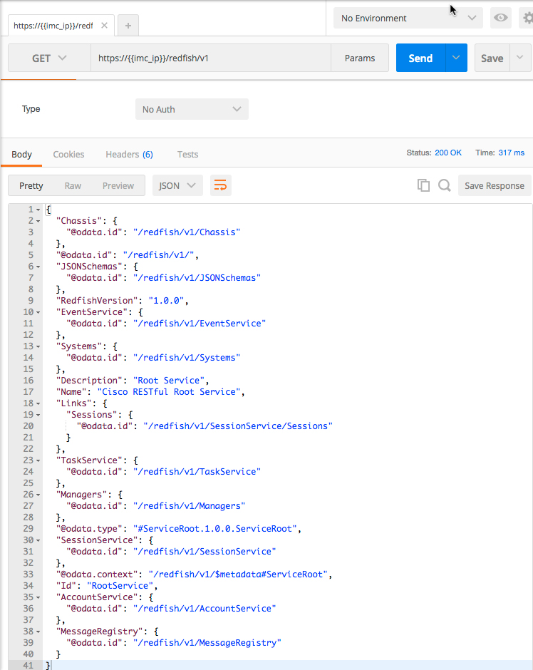

# Introductory UCS IMC Redfish REST API

### Exercise 2
Use a POST REST call to Login to the UCS IMC Redfish API and get an authorization token

1. Using Postman login to the IMC Redfish REST API.

    - Select the POST method

    - Enter the URL for the SessionService/Sessions resource

      ```
      https://{{imc_ip}}/redfish/v1/SessionService/Sessions
      ```
    - Leave **{{imc_ip}}** in the URL

    - Update the **Body**
      - Select the **raw** radio button
      - Replace the Username and Password values appropriate for your environment

      ```json
      {"Username":"admin", "Password":"ciscopsdt"}
      ```

    <br/><br/>

    Postman has programatic capability that allows you to

    - Create and set variables
    - Run a script prior to a request
    - Capture and utilize response output

    The URL specified above has a Postman variable in it, {{imc_ip}} is a variable that can be set by Postman before the IMC Redfish REST API request is made.

    Also Postman can test the HTTP Response for the presence of values and use those values to populate variables. Use the **Tests** section of the Postman interface to specify a **Test** and populate a variable.

    - Add the code below to the **Tests** section of the Postman request

    ```javascript
    tests["X-Auth-Token is present"] = postman.getResponseHeader("X-Auth-Token")

    if (tests["X-Auth-Token is present"]) {
      postman.setGlobalVariable("xAuthToken", postman.getResponseHeader("X-Auth-Token"));
    }
    ```

    <br/><br/>

    **DON'T** *Click* "Send" Yet!

2. Create variables that can be utilized by other operations in Postman.

    Create Global Variables

    - ***Click*** the "Eye"
    - ***Click*** "Edit"
    - Add a variable named "**imc_ip**", for it's value enter the IP of the UCS IMC that is being utilized
    - Add a variable named "**xAuthToken**" leave the value blank, the value will be updated by the code in the "Tests" section
    - ***Click*** "Save"
    - ***Click*** the "X" in the upper right corner to exit

    <br/><br/>

    <br/><br/>

3. Send the request by ***clicking*** "Send". If everything was correctly entered and the Redfish service is running a successful response is returned.

    <br/><br/>

    Postman will display the Response Body, ***click*** on "Headers" to display the Headers and view the xAuthToken.

    <br/><br/>

    Next ***click*** the "Eye" to view the global variables to see the update made to xAuthToken.

    <br/><br/>

This is the end of Exercise 2

### Exercise 3
Use an IMC Redfish REST API GET call to view the active Redfish sessions.

1. Setup the GET request for the Redfish Sessions resource.

    - Create a new tab in Postman, by ***clicking*** the "+" sign

    - Select the GET method

    - Enter the URL for the Sessions resource
      ```
      https://{{imc_ip}}/redfish/v1/SessionService/Sessions
      ```
    - Add a Header for Authorization
      - Key - "Authorization"
      - Value - "OAuth {{xAuthToken}}"

    <br/><br/>

2. Send the request by ***clicking*** "Send", view the response body.

    <br/><br/>

    With the GET call setup as shown the OAuth token is pulled in from the global variables setup in Postman. Most UCS IMC Redfish API calls will require authentication, there are a few calls however that do not require authentication and provide significant information.

This is the end of exercise 3

### Exercise 4
Explore the IMC Redfish REST API calls that do not require authentication.

1. What is the IMC Redfish REST API version?

    - Select the GET method

    - Enter the URL for the version resource
      ```
      https://{{imc_ip}}/redfish
      ```
    - Send the request by ***clicking*** "Send", view the response body.

    <br/><br/>

    ```json
    {
        "v1": "/redfish/v1/"
    }
    ```

2. To what Collections does the IMC Redfish REST API provide access?

    - Select the GET method

    - Enter the URL for the Collections resource
      ```
      https://{{imc_ip}}/redfish/v1
      ```
    - Send the request by ***clicking*** "Send", view the response body.

    <br/><br/>

    ```json
    {
        "Chassis": {
          "@odata.id": "/redfish/v1/Chassis"
        },
        "@odata.id": "/redfish/v1/",
        "JSONSchemas": {
          "@odata.id": "/redfish/v1/JSONSchemas"
        },
        "RedfishVersion": "1.0.0",
        "EventService": {
          "@odata.id": "/redfish/v1/EventService"
        },
        "Systems": {
          "@odata.id": "/redfish/v1/Systems"
        },
        "Description": "Root Service",
        "Name": "Cisco RESTful Root Service",
        "Links": {
          "Sessions": {
            "@odata.id": "/redfish/v1/SessionService/Sessions"
          }
        },
        "TaskService": {
          "@odata.id": "/redfish/v1/TaskService"
        },
        "Managers": {
          "@odata.id": "/redfish/v1/Managers"
        },
        "@odata.type": "#ServiceRoot.1.0.0.ServiceRoot",
        "SessionService": {
          "@odata.id": "/redfish/v1/SessionService"
        },
        "@odata.context": "/redfish/v1/$metadata#ServiceRoot",
        "Id": "RootService",
        "AccountService": {
          "@odata.id": "/redfish/v1/AccountService"
        },
        "MessageRegistry": {
          "@odata.id": "/redfish/v1/MessageRegistry"
        }
    }
    ```

    There are a number of Collections available, we will focus on some of them in later exercises.

3. Retrieve the IMC Redfish REST API Service Document.

    The DTMF defines the OData Service Document as 'Redfish Services shall expose an OData Service Document, at the "/redfish/v1/odata" resource. This service document provides a standard format for enumerating the resources exposed by the service, enabling generic hypermedia-driven OData clients to navigate to the resources of the service. Services shall not require authentication in order to retrieve the service document.'

      - Select the GET method

      - Enter the URL for the OData document
        ```
        https://{{imc_ip}}/redfish/v1/odata
        ```
      - Send the request by ***clicking*** "Send", view the response body.

    <br/><br/>

    ```json
    {
        "Value": [
          {
            "url": "/redfish/v1",
            "name": "Service",
            "kind": "Singleton"
          },
          {
            "url": "/redfish/v1/Systems",
            "name": "Systems",
            "kind": "Singleton"
          },
          {
            "url": "/redfish/v1/Chassis",
            "name": "Chassis",
            "kind": "Singleton"
          },
          {
            "url": "/redfish/v1/Managers",
            "name": "Managers",
            "kind": "Singleton"
          },
          {
            "url": "/redfish/v1/TaskService",
            "name": "TaskService",
            "kind": "Singleton"
          },
          {
            "url": "/redfish/v1/EventService",
            "name": "EventService",
            "kind": "Singleton"
          },
          {
            "url": "/redfish/v1/AccountService",
            "name": "AccountService",
            "kind": "Singleton"
          },
          {
            "url": "/redfish/v1/SessionService",
            "name": "SessionService",
            "kind": "Singleton"
          },
          {
            "url": "/redfish/v1/JSONSchemas",
            "name": "JSONSchemas",
            "kind": "Singleton"
          },
          {
            "url": "/redfish/v1/MessageRegistry",
            "name": "MessageRegistry",
            "kind": "Singleton"
          }
        ],
        "@odata.context": "/redfish/v1/$metadata"
    }
    ```

This is the end of Exercise 4
