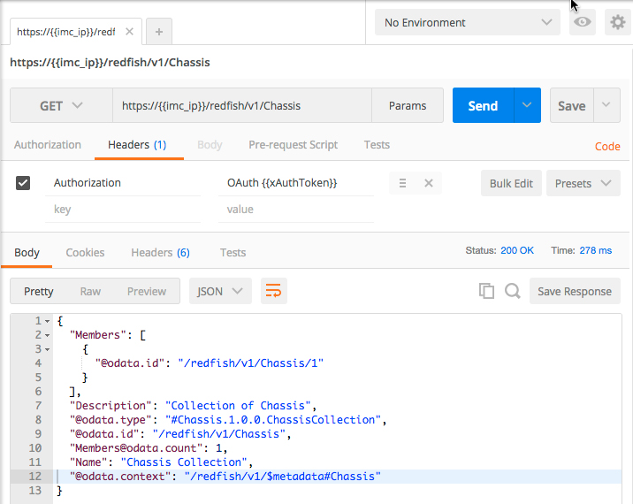

# Introductory UCS IMC Redfish REST API

### Exercise 5
Use various IMC Redfish REST API calls to obtain server information.

1. Setup the GET request for the Redfish Chassis resource.

    - Select the GET method

    - Enter the URL for the Chassis resource
      ```
      https://{{imc_ip}}/redfish/v1/Chassis
      ```
    - Add a Header for Authorization (if it does not already exist)
      - Key - "Authorization"
      - Value - "OAuth {{xAuthToken}}"

2. Send the request by ***clicking*** "Send", view the response body.

    <br/><br/>

    Notice that a single Chassis resource is returned, chassis 1.

3. GET the Chassis 1 resource.

    - Select the GET method

    - Enter the URL for the Chassis/1 resource
      ```
      https://{{imc_ip}}/redfish/v1/Chassis/1
      ```

4. Send the request by ***clicking*** "Send", view the response body.

    <br/><br/>

    ```json
    {
        "SerialNumber": "FCH1922V0Q2",
        "Id": "1",
        "IndicatorLED": "Off",
        "@odata.context": "/redfish/v1/$metadata#Chassis/Members/$entity",
        "ChassisType": "Rack",
        "Description": "It represents the properties for physical components for any system.  This one object is intended to represent racks, rackmount servers, blades, standalone, modular systems, enclosures, and all other containers.  The non-cpu/device centric parts of the schema are all accessed either directly or indirectly through this resource",
        "Thermal": {
          "@odata.id": "/redfish/v1/Chassis/1/Thermal"
        },
        "Status": {
          "State": "Enabled",
          "Health": "OK"
        },
        "Name": "Computer System Chassis",
        "Links": {
          "PoweredBy": [
            "/redfish/v1/Chassis/1/Power"
          ],
          "CooledBy": [
            "/redfish/v1/Chassis/1/Thermal"
          ],
          "ComputerSystems": [
            "/redfish/v1/Systems/FCH1922V0Q2"
          ],
          "ManagedBy": [
            "/redfish/v1/Managers/CIMC"
          ]
        },
        "Power": {
          "@odata.id": "/redfish/v1/Chassis/1/Power"
        },
        "Model": "UCS C240 M4SX",
        "@odata.type": "#Chassis.1.0.0.Chassis",
        "AssetTag": "Unknown",
        "Manufacturer": "Cisco Systems Inc.",
        "@odata.id": "/redfish/v1/Chassis/1",
        "LogServices": {
          "@odata.id": "/redfish/v1/Chassis/1/LogServices"
        },
        "Actions": {
          "#Chassis.Reset": {
            "Target": "/redfish/v1/Chassis/1/Actions/Chassis.Reset",
            "ResetType@Redfish.AllowableValues": [
              "On",
              "ForceOff"
            ]
          }
        }
    }
    ```

5. Under the Chassis resource there are several more resources that can be queried. Try a few more and explore these resources.

    - https://{{imc_ip}}/redfish/v1/Chassis/1/Power
    - https://{{imc_ip}}/redfish/v1/Chassis/1/Thermal
    - https://{{imc_ip}}/redfish/v1/Managers/CIMC

This is the end of exercise 5

### Exercise 6
Add/Update/Delete an IMC User account using the IMC Redfish REST API.

The IMC interface allows for 15 named users, user 1 is the **admin** user. The **admin** user can be enabled or disabled, it's password can be changed but it cannot be deleted nor can the user role of **admin** be changed. There are three IMC user roles,

  - read-only - A user with this role can view information but cannot make any changes.
  - user - A user with this role can perform the following tasks:
    - View all information
    - Manage the power control options such as power on, power cycle, and power off
    - Launch the KVM console and virtual media
    - Clear all logs
    - Toggle the locator LED
    - Set time zone
    - Ping
  - admin - A user with this role can perform all actions available through any interface, CLI, GUI, IPMI, Redfish, XML API.


1. Find an available IMC user account.

    - Select the GET method

    - Enter the URL for the AccountService/Accounts/2 resource

    ```
      https://{{imc_ip}}/redfish/v1/AccountService/Accounts/2
    ```

2. Send the request by ***clicking*** "Send", view the response body.

    <br/><br/>

3. If the output indicates that the Resource was not found then a user can be added to that user slot.

    ```json
    {
        "error": {
          "code": "ResourceNotFound",
          "message": "The resource /AccountService/Accounts/2 does not exist"
        }
    }
    ```

4. Add a user to an empty user slot

    - Select the POST method

    - Enter the URL for the AccountService/Accounts/2 resource

    ```
    https://{{imc_ip}}/redfish/v1/AccountService/Accounts/2
    ```

    - Place the JSON that defines the user in the body of the request.

      ```json
      {"UserName":"user2","Password":"Password123","RoleId":"user","Enabled":"true"}
      ```

5. Send the request by ***clicking*** "Send".

    No response is expected, however the HTTP status code will indicate success or failure in this case a **201 Created** should be displayed.

    <br/><br/>

6. Update the user to an admin role.

    - Select the PATCH method

    - Enter the URL for the AccountService/Accounts/2 resource
    ```
    https://{{imc_ip}}/redfish/v1/AccountService/Accounts/2
    ```

    - Place the JSON that defines the user in the body of the request.

      ```json
      {"UserName":"user2","Password":"Password123","RoleId":"admin","Enabled":"true"}
      ```

7. Send the request by ***clicking*** "Send", view the response body. The response will contain the JSON of the updated user.

    <br/><br/>

8. Delete the added user.

    - Select the DELETE method

    - Enter the URL for the AccountService/Accounts/2 resource
    ```
    https://{{imc_ip}}/redfish/v1/AccountService/Accounts/2
    ```

    - Delete the content from the **Body**

9. Send the request by ***clicking*** "Send".

    <br/><br/>

    Notice the Status should be 200 OK, if you were to try to make another Refish REST API request that required authentication it would fail.

This is the end of exercise 6

This concludes the lab - Introductory UCS IMC Redfish REST API
